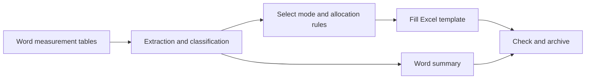

<div align="center">


# Original Record Auto-Fill · The Unification

**Fireproofing inspection records · Component classification · Automatic pagination · Excel and Word exports**

Turn Word inspection tables into organized Excel records and a Word summary.

   [](LICENSE)

[Features](#features) · [Four working modes](#four-working-modes) · [Quick start](#quick-start) · [User guide](docs/USAGE.md) · [Report an issue](https://github.com/kkkklck/original-record-auto-fill/issues)

</div>

---

A document automation tool for **steel-structure fireproofing inspection records**. It reads measurement tables from Word, classifies columns, beams, braces, space frames, and other components, then assigns records by date or floor and fills an Excel template. A companion Word summary supports checking and archiving.

## Features

| Capability | What it handles |
| :--- | :--- |
| **Word table extraction** | Detects measurement-point and average-value headers and processes relevant merged cells |
| **Classification and sorting** | Organizes columns, beams, braces, space frames, and other components by floor or identifier |
| **Rule-based allocation** | Supports date buckets, floor breakpoints, a single date, and floor-by-date slicing |
| **Template filling and pagination** | Copies required worksheets, fills metadata, and separates ordinary and μ pages |
| **Reports and summaries** | Exports Excel reports and a Word summary; adds a sequence number for conflicting Excel filenames |
| **Guided interaction** | Provides console prompts, allocation previews, help, and navigation to previous steps |

## From input to output



## Four working modes

| Mode | Best suited to | Allocation |
| :--- | :--- | :--- |
| **Mode 1 · By date** | Distributing one batch across several dates | Configure dates and component rules, then confirm the preview |
| **Mode 2 · Floor breakpoints** | Assigning floor intervals to different dates | Split floors into buckets and assign a date to each |
| **Mode 3 · Single date** | Using one date for an entire batch | Enter date and temperature once; paginate automatically |
| **Mode 4 · Floor × date** | Splitting a floor's records across multiple dates | Allocate evenly or set daily limits |

For a first run, start with **Mode 3**. See the [User guide](docs/USAGE.md) for detailed input rules.

## Quick start

### 1. Get the project and dependencies

Use **Python 3.10+**. The source includes annotations such as `str | None` and `list[int]`.

```bash
git clone https://github.com/kkkklck/original-record-auto-fill.git
cd original-record-auto-fill
python -m pip install openpyxl python-docx
```

### 2. Configure the Excel template

Open `Original record auto-fill program.py` and set `XLSX_WITH_SUPPORT_DEFAULT` near the beginning of the file to your local template path. The included template is **`防火excel模板μ.xlsx`**.

For example, replace this Windows path with your actual absolute path:

```python
XLSX_WITH_SUPPORT_DEFAULT = Path(r"C:\your-folder\original-record-auto-fill\防火excel模板μ.xlsx")
```

The current default points to the author's machine, so configure it before running elsewhere. Worksheet names and layout must match the program. Retain the relevant μ template sheets when processing μ data.

### 3. Run and generate records

```bash
python "Original record auto-fill program.py"
```

1. Enter the source Word `.docx` path. You can begin with the included `示例.docx` sample.
2. Follow the prompts for project name, commission identifier, and other metadata.
3. Choose a mode and enter dates, temperature, and allocation rules.
4. Review the allocation preview and confirm report generation.
5. Check components, values, dates, and pagination against the Word summary.

### Output files

| File | Location and purpose |
| :--- | :--- |
| `The Unification_报告版.xlsx` | Saved beside the source Word document; contains the printable records and receives a sequence suffix if the name already exists |
| `汇总原始记录.docx` | Saved beside the source document for checking extracted data; back up an existing summary before rerunning if needed |

Original Chinese filenames are retained in commands and paths to match the files supplied with the program.

## Usage notes

<details>
<summary><strong>Input requirements and shortcuts</strong></summary>

Use `.docx` tables with the Chinese measurement-point and average-value headers recognized by the parser. Close the Word and Excel files involved before running to avoid file-lock errors.

| Input | Action |
| :--- | :--- |
| `help` | Opens help at the source-path prompt |
| `q` | Returns to the previous interaction step |
| `Q` | Exits from the source-path prompt |

See the [User guide](docs/USAGE.md) for date formats, identifier ranges, and mode-specific instructions.

</details>

<details>
<summary><strong>Troubleshooting</strong></summary>

| Symptom | Suggested action |
| :--- | :--- |
| Template not found | Set `XLSX_WITH_SUPPORT_DEFAULT` to an existing local path |
| No data recognized | Check the `.docx` table structure and expected headers |
| Excel cannot be saved | Close the open template and destination report, then retry |
| Missing μ template | Check that the appropriate category's μ worksheet exists |
| Unexpected classification or dates | Review component names and the allocation preview before adjusting rules |

</details>

## Repository layout

```text
original-record-auto-fill/
├── Original record auto-fill program.py   # Console entry point
├── 防火excel模板μ.xlsx                     # Excel template
├── 示例.docx                              # Sample Word input
├── LICENSE                                # Commercial license terms
└── docs/                                  # Homepage artwork and user guide
```

## License and feedback

This project uses a **commercial license**. Use requires authorization from the author; see [LICENSE](LICENSE) and your licensing agreement for the permitted scope. Contact the author through their [GitHub profile](https://github.com/kkkklck) and report problems through [Issues](https://github.com/kkkklck/original-record-auto-fill/issues).

<div align="center">

<sub>Built by LCK · Less copying. More clarity.</sub>

</div>
